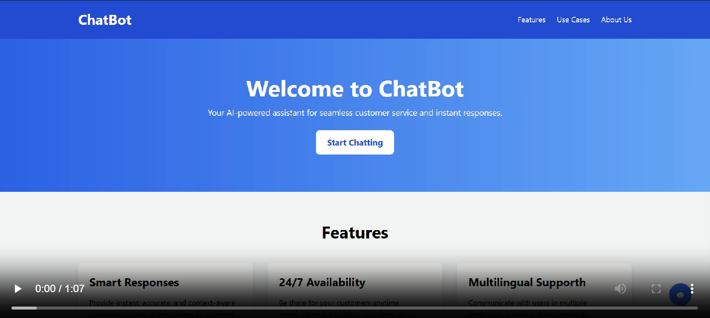

# Chat Bot

This repository contains the code for a Chat Bot project developed as part of learning Generative AI.

## Table of Contents
- [Introduction](#introduction)
- [Installation](#installation)
- [Usage](#usage)
- [Contributing](#contributing)

## Introduction
The Chat Bot is a web application built using React and the GEMINI API to facilitate continuous conversation. It functions similarly to other chatbots like GEMINI or ChatGPT, providing interactive and dynamic responses to user inputs.

## Contributing
Contributions are welcome! Please follow these steps to contribute:

1. Fork the repository.
2. Create a new branch (`git checkout -b feature-branch`).
3. Make your changes.
4. Commit your changes (`git commit -m 'Add some feature'`).
5. Push to the branch (`git push origin feature-branch`).
6. Open a pull request.

Thank you for your contributions!

## Demo

## Contact

For any queries or if you need the project please contact [pavankumargarapati04@gmail.com](mailto:pavankumargarapati04@gmail.com).